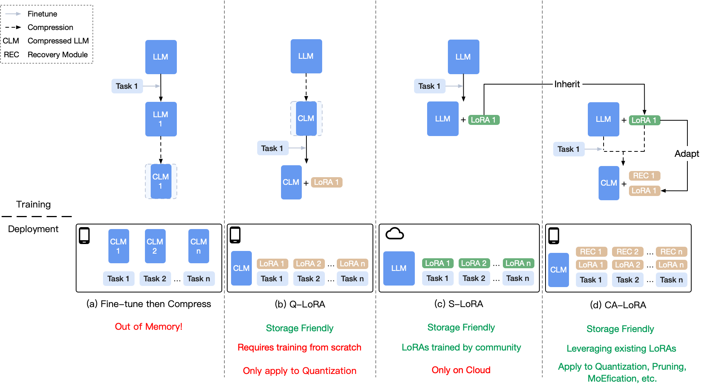

<div align="center">

<h1>CA-LoRA</h1>

**Adapting Existing LoRA for Compressed LLMs to Enable Efficient Multi-Tasking on Personal Devices**
</div>



## Introduction

Recently, there has been a demand to deploy Large Language Models (LLMs) on personal devices such as laptops and smartphones. These LLMs have different model variants when handling different tasks. However, personal devices have limited resources and require reduced storage overhead. To address this, there are two key methods available: the first is model compression, which compresses LLMs into smaller sizes; the second is LoRA, which can transfer an LLM to other tasks with very few parameters, avoiding the storage of multiple model variants in multi-task scenarios by only preserving LoRAs. However, our experiments show that directly combining these two methods yields sub-optimal performance. Considering that the open-source community has already contributed many LoRAs to LLMs, we propose to adapt these existing LoRAs from the LLMs to their compressed version and introduce a Compression-Aware LoRA (CA-LoRA) framework. We incorporate knowledge inheritance and recovery strategies to recover the lost knowledge caused by model compression. Experiment results demonstrate that CA-LoRA outperforms the vanilla LoRA methods applied to a compressed LLM and achieves comparable performance to the non-compressed LLM with existing LoRA modules. 

## Repo Content

This repo contains the code to reproduce the experimental results in our paper. 
- Section 4.1: [README](src/section-4.1/README.md) [Code](src/section-4.1)
- Section 4.2
  - 4.2.1: [README](src/section-4.2.1/README.md) [Code](src/section-4.2.1)
  - 4.2.2: [README](src/section-4.2.2/README.md) [Code](src/section-4.2.2)


## Citation

Please cite our [paper](https://arxiv.org/pdf/2307.07705) if you find our work valuable.

```
TODO
```
